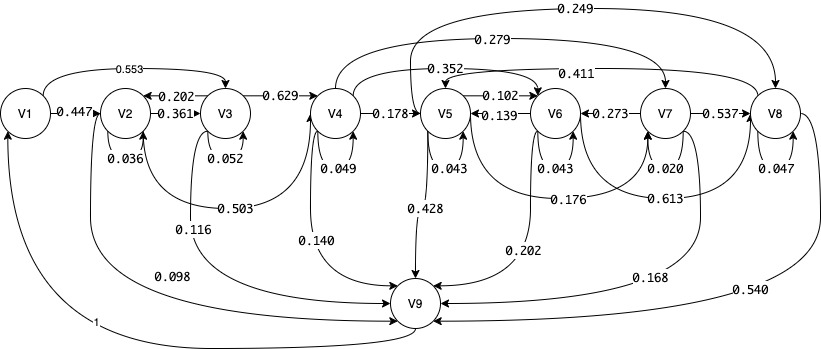

```{r setup, include=FALSE}
knitr::opts_chunk$set(echo = TRUE)
library('SciViews')
library('knitr')
```
### Question 1

```{r}
### Read-in the table
webtraffic <- read.delim("webtraffic.txt")
```

#### Part 1a
```{r}
Traffic <- matrix(colSums(webtraffic), nrow = 9, ncol = 9, byrow = TRUE)
Traffic[9,1]=1000
Traffic
```

The Traffic matrix is shown as above. 

#### Part 1b
Graph:
```{r}

```


This markov chain is **irreducible** as all states communicate with each other.

Consider this loop route:

V1 -> V2 -> V3 -> V4 -> V5 -> V6 -> V8 -> V5 -> V7 -> V9 -> V1

As all states were visited at least once and this route is a loop, we can conclude that all states communicate with each other therefore irreducible. 

This markov chain is also **ergodic** as it is **recurrent** and **aperiodic**.

**Recurrent:**

As all states connect with each other, this markov chain is recurrent. 

**Aperiodic:**

State 2-8 are aperiodic because they communicate with themselves within in one step.

State 1 is also aperiodic. Consider these two route below:

1: V1 -> V2 -> V9 -> V1 (step count = 4)

2: V1 -> V2 -> V3 -> V9 -> V1 (step count = 5)

gcd(4,5) = 1

Therefore, state 1 is aperiodic.

State 9 is aperiodic. Consider these two route below:

1: V9 -> V1 -> V2 -> V9 (step count = 4)

2: V9 -> V1 -> V2 -> V3 -> V9 (step count = 5)

gcd(4,5) = 1

Therefore, state 1 is aperiodic.


#### Part 1c
```{r}
P <- matrix(NA, nrow = 9, ncol =9)
Traffic_rowsum = rowSums(Traffic)

for(i in 1:nrow(P)){
  for (j in 1:ncol(P)){
    P[i,j] = Traffic[i,j]/ Traffic_rowsum[i]
  }
}
P
```


#### Part 1d
```{r}
start = c(1,rep(0,8))
prob5 = start %*% P %*% P %*% P %*% P %*% P
prob5[5]
```
The probability of a vistor being on Page 5 after 5 clicks is `r prob5[5]`.

#### Part 1e
```{r}
# make the network irreducible
Q = t(P) - diag(9)
Q[9,] = rep(1,9)
rhs = c(rep(0,8),1)

Pi = solve(Q,rhs)
Pi
```
The steady-state matrix vector is `r Pi`.

#### Part 1f
```{r}
B = P[1:8,1:8]
Q = diag(8)-B
rhs = c(0.1, 2, 3, 5, 5, 3, 3,  2)
m = solve(Q,rhs)
m[1]
```
Average time a visitor spends on the website is `r m[1]` seconds.

### Question 2

#### Part a
Determine the number of samples required to achieve an error tolerance of $10^{-3}$ with 99% confidence.
$$ n \geq \frac{\frac{1}{\lambda^2}}{(10^{-3})^2 0.01 }$$
$$ n \geq \frac{10^8}{\lambda^2}$$

### part b

#### lambda = 1
```{r}
## lambda = 1
set.seed(1009)
lambda = 1
n = 10^8
x = runif(n,0,1)
y = -ln(x)
g = sin(y)
result_1 = sum(g)/n
result_1_compare = 1 / (1+lambda^2)
```

The result using MCMC is `r result_1`. The result using the true value is `r result_1_compare`. The difference is `r result_1 - result_1_compare` which is smaller than the tolerance

#### lambda = 2
```{r}
## lambda = 2
lambda = 2
n = (10^8)/(lambda^2)
x = runif(n,0,1)
y = (-ln(x))/lambda
g = (sin(y))/lambda
result_2 = sum(g)/n
result_2_compare = 1 / (1+lambda^2)
```

The result using MCMC is `r result_2`. The result using the true value is `r result_2_compare`. The difference is `r result_2 - result_2_compare` which is smaller than the tolerance

#### lambda = 4
```{r}
## lambda = 2
lambda = 4
n = (10^8)/(lambda^2)
x = runif(n,0,1)
y = (-ln(x))/lambda
g = (sin(y))/lambda
result_4 = sum(g)/n
result_4_compare = 1 / (1+lambda^2)
```

The result using MCMC is `r result_4`. The result using the true value is `r result_4_compare`. The difference is `r result_4 - result_4_compare` which is smaller than the tolerance

### Question 3

#### part a

The exponential distribution is not symmetric. Therefore, we can not use Metropolis Algorithm.

We can not use gibbs sampling because it is for joint distribution. 

#### part b
```{r}
x = 1 ### x_t
n = 15000
t = rep(NA, n)

for (i in 1:n){
  candidate = rexp(n = 1, rate = x)
  alpha_top = dexp(x, rate = candidate) * dgamma(candidate, shape = 2, scale = 2)
  alpha_bottom = dgamma(x, shape = 2, scale = 2) * dexp(candidate, rate = x)
  alpha = alpha_top/alpha_bottom
  
  u = runif(1, min = 0, max = 1)
  
  if (u <= alpha){
    x = candidate
  }
  t[i] = x
} 
```

```{r}
#how to consider what to keep
t_remove_burnin = t[5001 : n]
#t_keep = rep(NA, 100)
#for (i in 1:100){
 # t_keep[i] = t_remove_burnin[100*(i-1) + 1]
#}
t_keep <- t_remove_burnin[seq(1, 9901, 100)]
```

#### part c
```{r}
plot(t_keep)
```
```{r}
plot(ts(t_keep))
```


First, I plot the samples we kept over their index. We see that in the plot, the dots randomly place. Therefore, this process is random. 

I also plot the samples we got over time. The plot is also completely random. Hence, I conclude that this process is random. 


```{r, include=FALSE}
hist(t_keep,50)
```


```{r, include = FALSE}
hist(t_remove_burnin,30)
```


